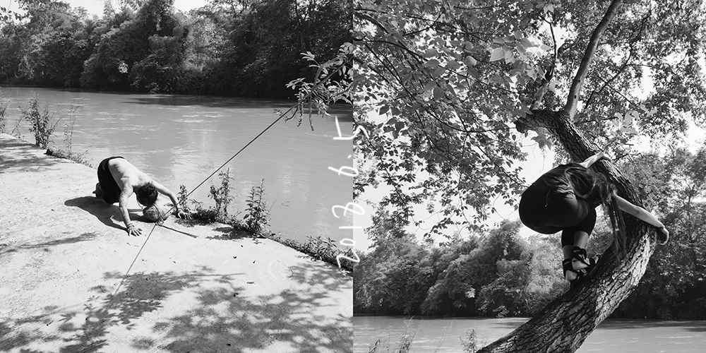
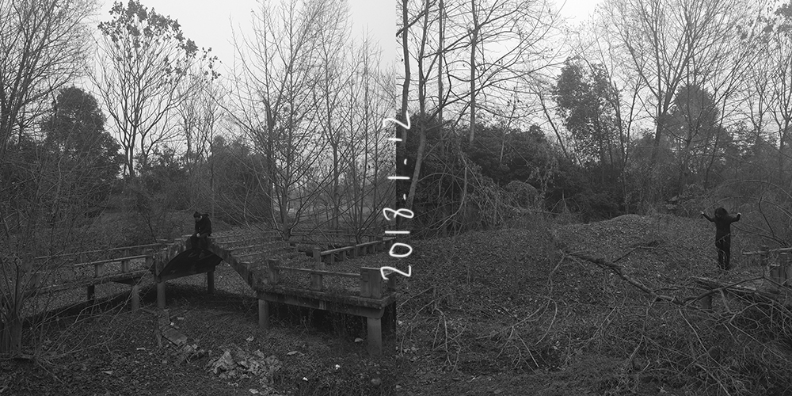
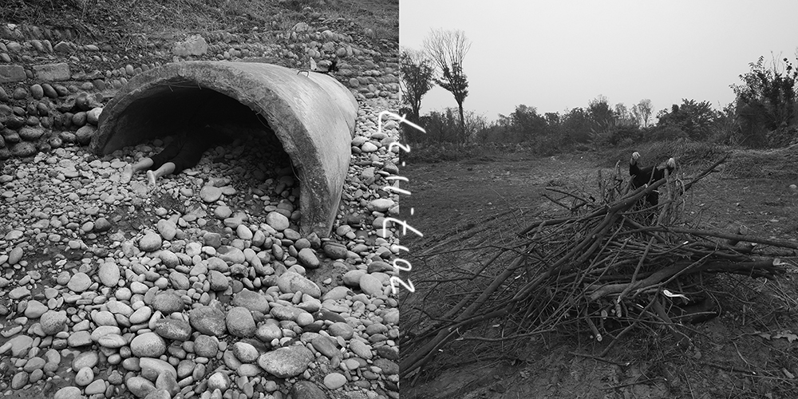

# 镜子
**MIRROR (2017.1.1–2018.12.31)**

《镜子》系列是我们两年时间共同完成的一组作品，它缘起于我们在一起已经15年的生活，时间累积的熟悉经验让流动的能量在我们之间停滞了，我们开始通过每一天的相互拍摄，以新的观察、打破、重建，重新寻找彼此的关系。这个系列开始拍摄于2017年1月1日，持续到2018年12月31日，每一天我们互相为对方拍摄一张照片，拼接在一起并在中缝写上当天的日期封存起来，两年730天1460张碎片般的照片量化了时间，探讨了我们关于生命、关系、爱的命题，通过镜像的对话互动，寻找自身的过程。

The "Mirror" series is a set of works that we completed together over the course of two
years. It originated from our 15-year life together, where accumulated familiarity caused the
flowing energy between us to stagnate. We began to use daily mutual photography to
observe, break, rebuild, and rediscover our relationship. This series started on January 1,
2017, and lasted until December 31, 2018. Every day we took a photo for each other, which
were pieced together and sealed with the date in the middle. The 730-day, 1460-
fragmented photos quantified time and explored themes related to life, relationships, and
love through mirrored dialogue and interaction, seeking self-discovery.
  

镜子，2017.8.19 
MIRROR，2017.8.19 
摄影｜收藏级艺术微喷，丙烯 
Photograph｜Archival Inkjet Print, Acrylic 

镜子，2018.7.9 
MIRROR，2018.7.9 
摄影｜收藏级艺术微喷，丙烯 
Photograph｜Archival Inkjet Print, Acrylic 

镜子，2017.5.31 
MIRROR，2017.5.31 
摄影｜收藏级艺术微喷，丙烯 
Photograph｜Archival Inkjet Print, Acrylic 

镜子，2018.10.11 
MIRROR，2018.10.11 
摄影｜收藏级艺术微喷，丙烯 
Photograph｜Archival Inkjet Print, Acrylic 

镜子，2018.4.29 
MIRROR，2018.4.29 
摄影｜收藏级艺术微喷，丙烯 
Photograph｜Archival Inkjet Print, Acrylic 

镜子，2017.11.22 
MIRROR，2017.11.22 
摄影｜收藏级艺术微喷，丙烯 
Photograph｜Archival Inkjet Print, Acrylic 

镜子，2018.12.18 
MIRROR，2018.12.18 
摄影｜收藏级艺术微喷，丙烯 
Photograph｜Archival Inkjet Print, Acrylic 

镜子，2018.4.17 
MIRROR，2018.4.17 
摄影｜收藏级艺术微喷，丙烯 
Photograph｜Archival Inkjet Print, Acrylic 

镜子，2017.12.4 
MIRROR，2017.12.4 
摄影｜收藏级艺术微喷，丙烯 
Photograph｜Archival Inkjet Print, Acrylic 

镜子，2018.1.16 
MIRROR，2018.1.16 
摄影｜收藏级艺术微喷，丙烯 
Photograph｜Archival Inkjet Print, Acrylic  

镜子，2017.2.3 
MIRROR，2017.2.3 
摄影｜收藏级艺术微喷，丙烯 
Photograph｜Archival Inkjet Print, Acrylic  

镜子，2017.7.2 
MIRROR，2017.7.2 
摄影｜收藏级艺术微喷，丙烯 
Photograph｜Archival Inkjet Print, Acrylic  

镜子，2018.8.9 
MIRROR，2018.8.9 
摄影｜收藏级艺术微喷，丙烯 
Photograph｜Archival Inkjet Print, Acrylic  

镜子，2017.8.25 
MIRROR，2017.8.25 
摄影｜收藏级艺术微喷，丙烯 
Photograph｜Archival Inkjet Print, Acrylic  

镜子，2017.7.16 
MIRROR，2017.7.16 
摄影｜收藏级艺术微喷，丙烯 
Photograph｜Archival Inkjet Print, Acrylic  

镜子，2017.5.28 
MIRROR，2017.5.28 
摄影｜收藏级艺术微喷，丙烯 
Photograph｜Archival Inkjet Print, Acrylic  

镜子，2018.3.12 
MIRROR，2018.3.12 
摄影｜收藏级艺术微喷，丙烯 
Photograph｜Archival Inkjet Print, Acrylic  

镜子，2017.12.11 
MIRROR，2017.12.11 
摄影｜收藏级艺术微喷，丙烯 
Photograph｜Archival Inkjet Print, Acrylic  

镜子，2017.9.6 
MIRROR，2017.9.6 
摄影｜收藏级艺术微喷，丙烯 
Photograph｜Archival Inkjet Print, Acrylic  

镜子，2017.2.18 
MIRROR，2017.2.18 
摄影｜收藏级艺术微喷，丙烯 
Photograph｜Archival Inkjet Print, Acrylic  

镜子，2017.2.1 
MIRROR，2017.2.1 
摄影｜收藏级艺术微喷，丙烯 
Photograph｜Archival Inkjet Print, Acrylic  

镜子，2018.6.5 
MIRROR，2018.6.5 
摄影｜收藏级艺术微喷，丙烯 
Photograph｜Archival Inkjet Print, Acrylic  

镜子，2017.9.1 
MIRROR，2017.9.1 
摄影｜收藏级艺术微喷，丙烯 
Photograph｜Archival Inkjet Print, Acrylic  

镜子，2017.7.21 
MIRROR，2017.7.21 
摄影｜收藏级艺术微喷，丙烯 
Photograph｜Archival Inkjet Print, Acrylic  

镜子，2018.1.15 
MIRROR，2018.1.15 
摄影｜收藏级艺术微喷，丙烯 
Photograph｜Archival Inkjet Print, Acrylic  

镜子，2017.12.18 
MIRROR，2017.12.18 
摄影｜收藏级艺术微喷，丙烯 
Photograph｜Archival Inkjet Print, Acrylic  

镜子，2018.12.4 
MIRROR，2018.12.4 
摄影｜收藏级艺术微喷，丙烯 
Photograph｜Archival Inkjet Print, Acrylic  

镜子，2018.1.8 
MIRROR，2018.1.8 
摄影｜收藏级艺术微喷，丙烯 
Photograph｜Archival Inkjet Print, Acrylic  

镜子，2017.6.21 
MIRROR，2017.6.21 
摄影｜收藏级艺术微喷，丙烯 
Photograph｜Archival Inkjet Print, Acrylic  

镜子，2017.2.2 
MIRROR，2017.2.2 
摄影｜收藏级艺术微喷，丙烯 
Photograph｜Archival Inkjet Print, Acrylic  

镜子，2018.1.14 
MIRROR，2018.1.14 
摄影｜收藏级艺术微喷，丙烯 
Photograph｜Archival Inkjet Print, Acrylic  

镜子，2018.1.12 
MIRROR，2018.1.12 
摄影｜收藏级艺术微喷，丙烯 
Photograph｜Archival Inkjet Print, Acrylic  

镜子，2017.5.30 
MIRROR，2017.5.30 
摄影｜收藏级艺术微喷，丙烯 
Photograph｜Archival Inkjet Print, Acrylic  

镜子，2017.3.9 
MIRROR，2017.3.9 
摄影｜收藏级艺术微喷，丙烯 
Photograph｜Archival Inkjet Print, Acrylic  

镜子，2017.11.9 
MIRROR，2017.11.9 
摄影｜收藏级艺术微喷，丙烯 
Photograph｜Archival Inkjet Print, Acrylic  

镜子，2017.6.16 
MIRROR，2017.6.16 
摄影｜收藏级艺术微喷，丙烯 
Photograph｜Archival Inkjet Print, Acrylic  

镜子，2018.7.28 
MIRROR，2018.7.28 
摄影｜收藏级艺术微喷，丙烯 
Photograph｜Archival Inkjet Print, Acrylic  

镜子，2018.9.19 
MIRROR，2018.9.19 
摄影｜收藏级艺术微喷，丙烯 
Photograph｜Archival Inkjet Print, Acrylic  

镜子，2017.1.22 
MIRROR，2017.1.22 
摄影｜收藏级艺术微喷，丙烯 
Photograph｜Archival Inkjet Print, Acrylic  

镜子，2017.7.13 
MIRROR，2017.7.13 
摄影｜收藏级艺术微喷，丙烯 
Photograph｜Archival Inkjet Print, Acrylic  

镜子，2018.2.23 
MIRROR，2018.2.23 
摄影｜收藏级艺术微喷，丙烯 
Photograph｜Archival Inkjet Print, Acrylic  

镜子，2017.11.8 
MIRROR，2017.11.8 
摄影｜收藏级艺术微喷，丙烯 
Photograph｜Archival Inkjet Print, Acrylic  

镜子，2017.11.18 
MIRROR，2017.11.18 
摄影｜收藏级艺术微喷，丙烯 
Photograph｜Archival Inkjet Print, Acrylic  

镜子，2017.4.7 
MIRROR，2017.4.7 
摄影｜收藏级艺术微喷，丙烯 
Photograph｜Archival Inkjet Print, Acrylic  

镜子，2018.1.10 
MIRROR，2018.1.10 
摄影｜收藏级艺术微喷，丙烯 
Photograph｜Archival Inkjet Print, Acrylic  

镜子，2017.11.27 
MIRROR，2017.11.27 
摄影｜收藏级艺术微喷，丙烯 
Photograph｜Archival Inkjet Print, Acrylic  

镜子，2018.1.2 
MIRROR，2018.1.2 
摄影｜收藏级艺术微喷，丙烯 
Photograph｜Archival Inkjet Print, Acrylic  

镜子，2017.12.3 
MIRROR，2017.12.3 
摄影｜收藏级艺术微喷，丙烯 
Photograph｜Archival Inkjet Print, Acrylic  

镜子，2017.8.7 
MIRROR，2017.8.7 
摄影｜收藏级艺术微喷，丙烯 
Photograph｜Archival Inkjet Print, Acrylic  

镜子，2018.6.20 
MIRROR，2018.6.20 
摄影｜收藏级艺术微喷，丙烯 
Photograph｜Archival Inkjet Print, Acrylic  

镜子 (全系列 730组) 
MIRROR (Series 730pic) 
摄影｜收藏级艺术微喷，丙烯 
Photograph｜Archival Inkjet Print, Acrylic 